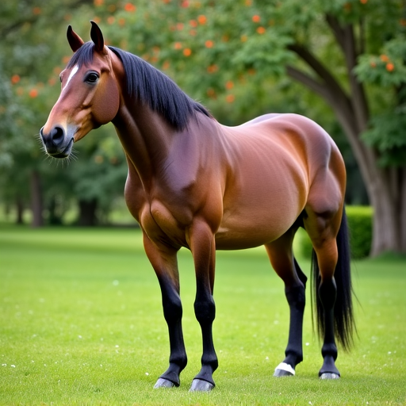
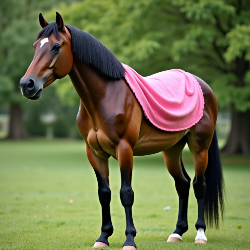

# Add-it
Unoffical Implementation of [Add-it: Training-Free Object Insertion in Images With Pretrained Diffusion Models](https://arxiv.org/abs/2411.07232)

## Get started:

To implement this in flux i had to edit the diffusers package - the custom diffusers package can be found [here](https://github.com/mihirp1998/diffusers_addit)

You can simply install the custom diffusers via this: 

``pip install 'git+https://github.com/mihirp1998/diffusers_addit'``

To edit run:

``python main.py``

vary the gamma hyperparamter [here](https://github.com/mihirp1998/Add-it/blob/46e71ab01c4faf8db75274a46f8d8c9df53fce44/main.py#L20) to vary the input image importance, reducing the gamma gives more importance to the input image while increasing gives more importance to the target prompt.

## Results:

Input Image          |  Editted image - The horse is wearing a pink dress.
:-------------------------:|:-------------------------:
  |  

